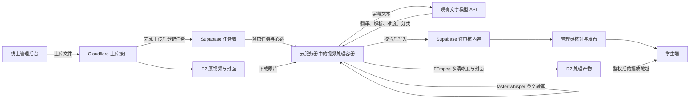

# Eastudy 云端视频处理与后台界面方案

日期：2026-09-08。本文是目标设计；其中的云端任务服务尚未部署。Beta 6.25.3 仅修复操作列裁切和线上误调用本机服务，不宣称云端自动处理已完成。

## 1. 当前到底部署了什么

| 部分 | 当前代码实际行为 | 对运营者的含义 |
| --- | --- | --- |
| Cloudflare Pages | 托管学生端、管理端及轻量 Functions | 网页可以在公网打开 |
| Cloudflare R2 上传接口 | `functions/api/admin/uploads/*` 完成分片和原文件存储；完成接口没有创建处理任务 | 即使某个视频成功上传，仍不代表已转码或已有字幕；实际可用性取决于线上 R2 绑定 |
| Supabase | 登录、权限、内容快照、学习记录和视频回收站 | 保存业务数据；不会自动运行 Python 或 FFmpeg |
| 当前批量导入 | `shared/studio-client.js` 原先固定请求 `http://127.0.0.1:8788/jobs` | 文件送到打开网页的那台电脑，而非 R2；截图中的失败上传不能视为云端上传成功 |
| 视频处理程序 | `services/local-studio/`：FFmpeg 转码、faster-whisper 转写、调用文字模型 | 目前运行在本机，任务 JSON 和媒体也在本机 |
| AI 连接配置 | 浏览器 localStorage；连接测试请求 `/models` | 只验证一个接口可响应，未验证语音识别、结构化生成、视频处理和云端持久化 |

`127.0.0.1` 的意思是“当前访问者自己的电脑”。把网页上传到 Cloudflare，并不会把该地址变成云服务器地址。当前 Python 程序也只允许本地网页来源，不能靠打开本机程序就把公网后台补成可靠的云端处理平台。

上一轮上线完成的是网站版本和回收站迁移，完整云端视频生产链仍然缺失。

## 2. 用户最终应该怎么操作

1. 浏览器打开线上后台，选择一批视频；每个视频可单独选封面，英文标题自动读取文件名。
2. 填写创作者，系统匹配已有创作者；不允许空白、`null` 或 `undefined`。
3. 点击“上传并自动处理”。每个文件先显示真实上传进度。
4. 每条视频单独显示“已上传，已加入处理队列”。只有收到服务端任务 ID 才允许这样提示。
5. 进入“处理任务”查看：检查视频 → 生成清晰度 → 识别英语 → 生成翻译与学习内容 → 待核对。
6. 人工核对标题、创作者、双语字幕、时间轴、难度与分类，再点击“发布”。
7. 学生端读取已发布版本，使用适合网络的清晰度播放。

上传未完成时关闭浏览器会中断剩余上传。只有原文件上传完成且任务持久化入队后，才可以关闭浏览器或电脑而不影响处理。页面“稍后处理”也不能暗示本机尚未上传的 File 对象已经保存。

## 3. 推荐架构：保留现有平台，增加云端处理程序



建议第一阶段使用一台支持 Docker 的 Linux 云服务器，运行 Python 处理容器。处理进程通过数据库领取任务，只需主动访问 Supabase、R2 和 AI 服务，不必把原本未鉴权的本地 HTTP 服务暴露到公网。

可从 4 vCPU、8 GB 内存、80 GB SSD、并发 1 个视频开始压测；这是容量起点而非速度承诺。20 分钟视频处理速度取决于源分辨率、转码参数和转写模型，需要真实样片测量。按单文件 2 GB 限制设置磁盘预留、总时长上限和队列配额。已有服务器可复用；尚无服务器时需要选定地域、预算和提供商，本文不创建付费资源。

本方案继续在云端运行 faster-whisper，现有文字 API 用于翻译和学习内容，因此不假定它提供语音转写接口。若后续需要更快处理，可改为 GPU 或经过验证的托管转写服务，时间轴契约保持不变。

普通 Pages Functions 负责鉴权、上传和短请求。当前 Python、原生 FFmpeg 与转写模型需要容器运行环境，不能直接当成静态网页文件运行。第一阶段复用 Supabase 实现持久队列，不额外引入 Redis。

## 4. 界面设计

### 视频列表

- 勾选列固定紧凑宽度；标题占剩余空间，长标题省略并可查看全文。
- “查看、编辑、处理、删除”留足宽度，操作列固定在表格右侧。
- 桌面侧栏打开、浏览器缩放和手机窄屏时，表格内部可横向滚动；所有按钮保持可点。
- 列名区分“发布状态”和“处理进度”：例如“草稿 / 生成字幕中”，避免“待审核 / 处理中”的混乱组合。
- 未入队的历史记录显示“未启动”或“状态待确认”；依据任务表校验，禁止凭浏览器旧缓存显示正在处理。

### 导入窗口

顺序：服务状态 → 创作者 → 文件列表（标题 / 单独封面 / 上传进度）→ AI 自动生成项目 → 主按钮。

服务状态拆成“文件存储”“视频处理”“AI 内容生成”三项，以实际接口检测结果为准。只在处理服务心跳、存储权限、模型调用均通过时，主按钮显示“上传并自动处理”。

处理程序暂不可用但存储正常时，可设计“仅上传为草稿”：明确不会自动处理，后续可从已有 R2 文件发起任务，无需重新选择原片。此降级功能要在服务端完成上传记录后再开放，本次界面修复不伪造它。

Beta 6.25.3 过渡态：线上显示“云端自动处理尚未接入”，禁用无法成功的批量处理；线上不再请求 `localhost`。本地开发环境保留连接检测与重新检查按钮。

### 处理任务与错误

- 上传显示字节百分比；转码可根据 FFmpeg 已处理时长显示进度；没有真实进度的 AI 阶段显示阶段名和耗时，避免假精确百分比。
- 任务卡提供当前阶段、排队时间、已生成清晰度、字幕条数、可理解的错误和“重试失败阶段”。
- “API 连接成功”只表示连接；设置页另展示语音识别可用、模型实际生成校验、处理服务最近心跳。
- API Key 保存到服务端的密钥存储，仅展示“已配置”和更新状态；浏览器不回读明文，不写入任务行。

## 5. 接口契约（目标，不是当前已存在的接口）

沿用 Supabase 管理员登录，业务入口使用同源 `/api/admin/*`。所有接口验证登录和角色；数据库表对客户端不开放直接写权限。

| 接口 | 输入 | 输出与语义 |
| --- | --- | --- |
| `GET /api/admin/processing/status` | 无 | 存储、处理器心跳、ASR、文字模型分别报告就绪状态，不返回密钥 |
| `POST /api/admin/upload-sessions` | 文件名、字节数、类型、可选封面、标题、creatorId、幂等键 | uploadSessionId、mediaId、partSize；复用现有 R2 分片实现，记录所有者 |
| `PUT /api/admin/upload-sessions/:id/parts/:part` | 文件分片 | 已确认的 partNumber、etag；验证所有者与分片限额 |
| `GET /api/admin/upload-sessions/:id` | 无 | 已上传分片、状态、过期时间；用于恢复上传，不仅依赖浏览器数组 |
| `POST /api/admin/upload-sessions/:id/completion` | 分片清单 | 检查 R2 大小、媒体元数据后登记 `UPLOADED`；重试返回同一结果 |
| `POST /api/admin/processing-jobs` | mediaId、videoId、expectedContentVersion、options；Idempotency-Key 请求头 | 202：jobId、QUEUED；只有持久化成功才确认入队 |
| `GET /api/admin/processing-jobs?page=1&pageSize=20` | status、videoId 可选过滤 | data 与 pagination；上限 100 条 |
| `GET /api/admin/processing-jobs/:id` | 无 | 阶段、产物、耗时、错误、是否可重试 |
| `POST /api/admin/processing-jobs/:id/retries` | 幂等键、expectedVersion | 重试版本；仅重新运行缺失或失败阶段 |

新增接口统一错误：`{error:{code,message,retryable,requestId}}`。400 格式错误；401 未登录；403 无权限；404 不存在；409 版本冲突；413 文件过大；422 无音轨/模型结果无效；503 处理服务未就绪。旧上传接口保留兼容，新增版本不要悄悄改变旧错误结构。

```ts
type JobStatus = 'QUEUED' | 'RUNNING' | 'REVIEW' | 'ERROR' | 'CANCELLED';
type JobStage = 'probe' | 'transcode' | 'asr' | 'enrich' | 'validate' | 'review';
interface ProcessingJob {
  id: string;
  videoId: string;
  mediaId: string;
  status: JobStatus;
  stage: JobStage;
  progress: number | null;
  attempt: number;
  version: number;
  subtitleCount: number;
  variants: Array<{ height: number; assetId: string }>;
  error: null | { code: string; message: string; retryable: boolean };
  createdAt: string;
  updatedAt: string;
}
```

## 6. 数据与任务可靠性

新增私有表：

- `media_assets`：UUID、video_id、R2 key、kind、字节数、mime、uploaded_by、source_version、verified_at。
- `upload_sessions`：UUID、media_id、owner_id、R2 upload id、expected_size、状态、过期时间。
- `processing_jobs`：UUID、video_id、source_asset_id、请求幂等键、pipeline_version、status、stage、attempt、lease_owner、lease_until、heartbeat_at、输入内容版本、结果引用、error。
- `processing_attempts`：job_id、attempt、lease_token、各阶段开始/结束、模型与版本、用量、错误；日志不含密钥。
- `processing_workers`：worker_id、能力、版本、last_seen_at，用于就绪检测；“有任务行”不等于“有人执行”。

领取任务在单个数据库事务内完成：`SELECT ... FOR UPDATE SKIP LOCKED` 选择待处理任务，再设置租约。领取后定期续约；进程崩溃后租约过期，其他进程可重试。阶段提交必须匹配 lease_token 和 attempt，迟到的旧进程不能覆盖新结果。调度器对异常退出设置最大重试次数和退避时间。

R2 上传与 PostgreSQL 不是一个事务：R2 合并成功、数据库确认失败时，重复完成请求根据对象 HEAD 对账后补记，而不是重新上传。任务入队单独可重试，幂等键保持稳定。存储已成功而入队失败时，界面显示“已上传，任务未启动”，允许重新提交任务。

AI 调用按源文件版本、字幕块哈希、模型、提示词版本保存已确认结果。对于供应商不支持幂等、且响应丢失的情况，不能承诺绝不重复计费；限制自动重试次数并记录费用估算。

## 7. 处理结果和云端播放

1. 保留原片；根据实际源分辨率生成不超过源片的 480p / 720p / 1080p，不强行把低清放大。
2. 抽取音频，faster-whisper 生成真实句子与词级时间轴；无音轨或零字幕应明确失败。
3. 对字幕分段调用文字模型，输出翻译、重点表达、语法、难度、分类、学习目标、口语化中文简介。
4. 验证句子 ID、时间范围、顺序、英文来源、JSON schema、分类枚举；不合格不能进入“待审核”。
5. 每次 attempt 上传到独立的 R2 产物前缀，完整校验后再切换该视频的有效产物版本。
6. 云端版本禁止写入 `localhost` 媒体地址。

现有 `functions/api/media.js` 的 key 校验只接受单层文件路径，而且 master.m3u8 使用查询参数地址时，内部相对分片路径不能直接正确解析。因此迁移不能只把 master 地址替换为 R2 地址：需新增资产路由、支持白名单的版本目录，并重写 master/variant 中每个 URI 到受保护的同源播放地址；分片、初始化段、封面都要校验所属视频和角色。已发布的视频向有权限学员开放，草稿仅管理员可访问。禁止路径遍历与任意公网 URL 读取。

短期兼容现有 `private.content_snapshots` 时，处理结果通过专用事务 RPC 按 video_id 合并并增加 revision：验证源版本、任务版本、删除标记和预期内容版本；保留其他视频和人工编辑。不能让 Worker 把一份旧的完整快照覆盖全站内容。

现有浏览器的全量保存/发布接口也必须增加 expected_revision 校验并处理 409，否则管理员旧快照仍能覆盖 Worker 的结果。发生人工编辑冲突时保留生成结果供人工接受；不会自动覆盖。后续视频数量增长再迁移成逐视频、逐字幕关系表。

删除中的视频取消未完成任务；正在执行的任务在阶段边界和提交前检查 tombstone。回收站期间保留 R2 文件，旧任务回调不能让视频复活。恢复为草稿，需要重新审核后发布。

## 8. 实施顺序与验收

1. **本次修复**：操作列宽度与滚动、线上禁用本机调用、服务状态说明，发布 Beta 6.25.3。
2. **任务与上传**：新增私有表和受控 RPC、上传记录、入队/查询/重试接口、服务状态检测。先在隔离测试数据上验证权限、幂等和版本冲突。
3. **云端处理器**：复用 contracts/media_tools/ai_tools/pipeline 的纯处理逻辑；新增 Dockerfile、依赖锁定、数据库队列适配、R2 产物适配、服务端密钥配置。`server.py` 的本地无鉴权 HTTP 入口不直接上线。
4. **播放与内容提交**：鉴权 HLS 资源路由、任务结果事务提交、管理员 revision 检查、人工审核发布。
5. **接通界面**：就绪接口真实通过后开放“上传并自动处理”。线上批量导入改用云端 API，删除前端传 AI Key 和读取本地 Job 的逻辑。
6. **验收后启用**：用授权的短视频完整跑一遍上传→关网页→服务器继续处理→另一台设备审核→学生播放，记录实际耗时与费用。

验收必须包括：

- 320 / 768 / 1024 / 1440 / 1920 宽度，浅色/深色，操作按钮均不被遮挡。
- 线上页面打开和导入全程不请求 127.0.0.1；处理器掉线显示真实异常，不伪造完成。
- 原片上传成功、入队失败，可从 R2 原片补建任务；上传中的断线可恢复已确认分片。
- 模拟进程被终止，租约过期后可恢复，旧 attempt 不能覆盖新结果。
- 三档清晰度按源分辨率生成；HLS 每一级清单、每个分片均可鉴权读取和播放。
- AI 错误、超时、零字幕、无音轨均停留在可解释状态；无法自动发布。
- 删除/恢复、两名管理员同时编辑、处理期间人工编辑不会造成丢失或旧版本覆盖。
- 浏览器、Git、任务记录、公开静态文件中没有新增私钥；云处理器凭据按服务权限配置。

本地开发仍可以使用启动脚本，但它不再是线上运营前置条件。云端设计完成不等于云端服务已部署；需要落实服务器资源及端到端实现后，才可以宣称“电脑关机后自动处理”。
