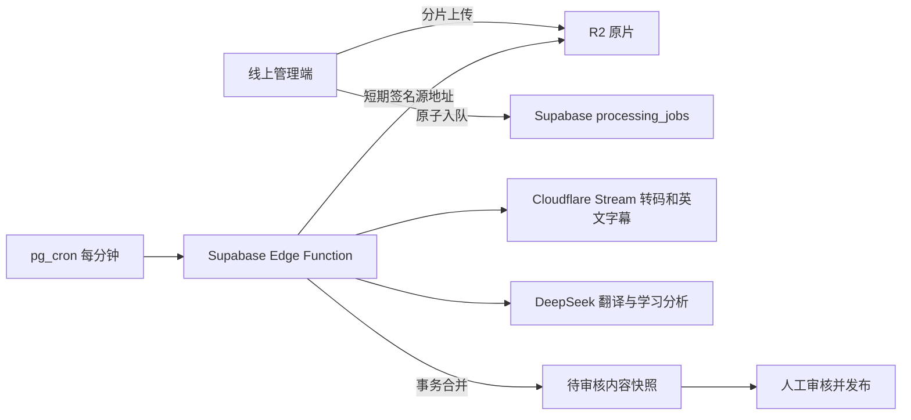

# Eastudy 云端视频处理与后台界面方案

日期：2026-09-08。Beta 6.25.4 已把原先仅能在开发电脑运行的处理流程改为持久云端任务。

## “本地服务”和“云端上传”不是一回事

R2 上传只负责保存原片，不会自动转码、听写英语或调用 DeepSeek。旧版 `services/local-studio/` 需要在运营者电脑上运行 FFmpeg 和 Whisper，所以称为“本地服务”；网页关闭后 Python 仍可运行，但电脑关机后就会停止。

生产版不再依赖运营者电脑：

DeepSeek 是文字模型，只负责已有字幕之后的翻译、语法、难度、分类和简介。它不能代替视频存储、转码、音轨识别、任务调度。因此“DeepSeek API 已连接”只是整条链路中的一个环节。

## 实际状态机

`STREAM_SUBMIT → STREAM_ENCODING → CAPTIONING → ENRICH → METADATA → REVIEW`

- `STREAM_SUBMIT`：生成两小时有效、只绑定单个任务的 R2 源文件令牌，并让 Stream 拉取原片。
- `STREAM_ENCODING`：轮询真实 Stream 状态，不用浏览器假进度。
- `CAPTIONING`：由 Stream 生成英文字幕，读取 VTT 并校验时间范围。
- `ENRICH`：每 20 句调用一次 DeepSeek；校验句子 ID、翻译、语法和重点表达必须来自原句。
- `METADATA`：生成中文标题、简介、CEFR 难度、主题和学习目标，再校验枚举与证据句。
- `REVIEW`：只进入人工审核，不自动发布给学生。

任务使用 `FOR UPDATE SKIP LOCKED` 原子领取，并保存 `lease_token` 和到期时间。Edge Function 超时后租约可恢复；旧执行者必须带同一租约才能更新。失败重试从失败阶段继续，已生成的 Stream 资产和 AI 分批结果不会无条件清空。

## 删除与恢复

删除是逻辑删除：

1. 锁定内容 revision，拒绝旧管理页面覆盖新结果。
2. 把活动 normalized job 标记为 `CANCELLED`。
3. 保存完整草稿/发布内容到 `private.content_video_trash`。
4. 从内容快照剥离视频、字幕和任务显示记录。
5. R2 原片和 Stream 资产均不物理删除。

Worker 提交结果前再次检查回收站 tombstone。即使外部服务迟到返回，也不能把已删除视频复活。恢复时回到草稿，必须重新人工审核后发布。

## 管理端设计

- 生产批量导入只在健康接口同时确认 Stream、DeepSeek 和签名源地址均已配置时开放。
- 上传成功并拿到数据库任务 ID 后，才显示“云端后台处理中”。上传未完成前关闭网页仍会中断当前文件。
- 处理队列读取 `processing_jobs`，展示真实阶段、进度、错误和阶段重试。
- 生产设置页不再接收或保存 API Key，只显示“服务端已配置/未配置”。localhost 开发环境仍保留本地服务配置。
- 视频列表给操作列固定 224px，右侧吸附；表格内部横向滚动，查看、编辑、处理、删除均保持可见。

## 生产组件与密钥

Supabase Secrets：

- `DEEPSEEK_API_KEY`、`DEEPSEEK_BASE_URL`、`DEEPSEEK_MODEL`
- `CLOUDFLARE_ACCOUNT_ID`、`CLOUDFLARE_STREAM_TOKEN`
- `PUBLIC_SOURCE_BASE_URL`
- `CRON_SECRET`

密钥不进入静态 JavaScript、任务数据或 Git。健康接口只返回每一项是否已配置。

## 验收标准

- Supabase 表开启 RLS，客户端只能通过管理员 RPC 创建、查询和重试任务。
- cron 可持续触发 Edge Function；无任务时安全返回，有任务时只领取到期且未取消的任务。
- 生产页面不请求 `127.0.0.1`，浏览器关闭后已入队任务继续推进。
- VTT 为空、Stream 报错、DeepSeek 超时或结构无效都会进入可解释 `ERROR`，不会伪装完成。
- 处理结果进入 `REVIEW`，字幕未人工确认前不能发布。
- 删除活动任务立即成功；迟到结果不回写；恢复后仍是草稿。
- 320 / 768 / 1024 / 1440 / 1920 宽度下，操作按钮可通过固定列或表格内部滚动访问。
- 学生端只读取已发布投影，播放 Stream HLS，并保持当前登录鉴权边界。
