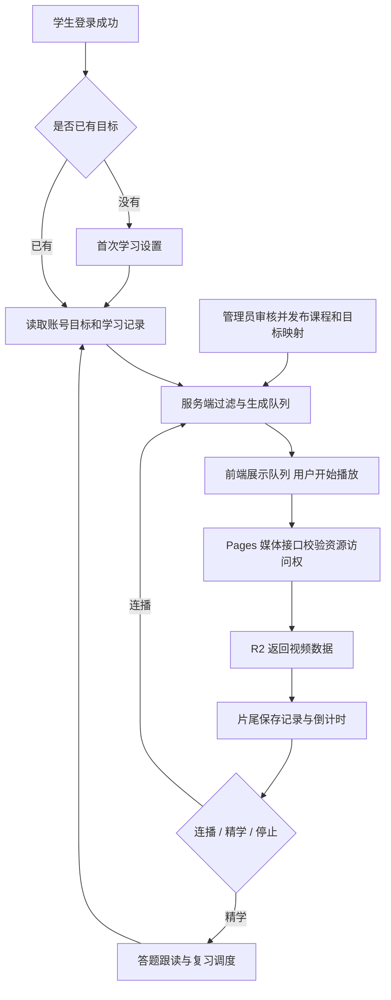

# Eastudy 学习目标选择与视频自动连播制作方案

日期：2026-09-08  
代码审计基线：`bdeb84c`，Beta 6.23.0。  
交付性质：产品设计与工程实施方案，尚未实现或部署本轮连播功能。

## 1. 建议采用的方案

**首次学生登录成功后选择学习目标；首页固定显示主目标；用户点击“开始目标学习”后，系统按该目标生成队列，视频结束后倒计时 5 秒自动进入下一条。**

以四级为例：用户选择“四级”，后续默认播放经过审核、适合其当前水平的四级关联内容。系统可跨多个四级合集继续播放，但不会自行切成雅思、六级或泛娱乐视频。用户主动指定某个合集时，只循环该合集。

“持续连播”分为两个独立设置：

- **自动播放下一条**：当前视频结束后自动切换；目标连播模式默认开启。
- **本轮播完后循环**：本目标候选池走完一遍后进入下一轮；目标连播模式默认开启，并在启动时明确显示。允许关闭，关闭后在本轮末尾停止。

首次打开网站仍先显示学生登录页。目标选择只出现在认证成功之后；管理员认证流程不参与学生引导。用户曾经选择过目标，下次登录直接恢复，避免每次重复填写。

下文的 5 秒倒计时、队列条数、排序权重、练习比例都是本项目的初始产品参数，需要小规模测试后调整，并非别家产品公开的固定规则。

## 2. 调研得到的可借鉴做法

本轮通过 Google 查找资料，并读取官方文章、技术文档和公开源代码。商业产品的内部推荐代码未公开，以下明确区分“公开可证实的行为”“开源实现”和“为 Eastudy 提出的设计”。没有登录或购买其他学习产品来验证其全部当前版本界面。

| 来源 | 已核实内容 | Eastudy 借鉴方式 |
|---|---|---|
| Duolingo 官方学习路径介绍 [S1] | 将课程组织为有顺序的路径；把练习、复习和故事安排进路径，课程顺序考虑间隔复习 | 用户不必每条视频都重新选；教师编排主线，系统把适当复习放进计划 |
| YouTube 官方自动播放帮助 [S2] | 视频结束后接续相关视频；提供下一条预告、开关和取消；播放页外的用户操作可能阻止继续；不同设备可有不同设置 | 播放器展示“接下来”，提供倒计时取消，离页后停止；不追求后台无限播放 |
| Anki 官方 FSRS 说明 [S3] | 根据复习历史安排间隔；提高目标保留率会增加复习工作量；答忘了和答得困难代表不同证据 | 复习安排由实际回忆结果驱动，观看次数不能直接当掌握程度 |
| Video.js Playlist 开源代码 [S4] | 队列类负责项目、索引、重复；自动切换类监听 `ended`，管理延时、取消和事件清理 | 分开实现队列引擎与播放器控制器，避免把复杂逻辑全部塞进 `ended` 回调 |
| Chrome 官方自动播放文档 [S5] | 带声音自动播放受浏览器策略限制，`play()` 返回的 Promise 可能拒绝 | 第一条由用户点击播放，后续尝试自动播放；被拦截时显示继续按钮 |
| MDN `ended` 文档 [S6] | `ended` 不冒泡；当原生 `loop=true` 且播放速度非负时不会触发 | 直接绑定实际 video 元素；合集循环用队列完成，不设置原生单视频无限循环 |
| 本地 teach 技能 [S8] | Mission、短而聚焦的课、反馈、检索练习、间隔练习、学习证据和最近发展区 | 把“学习目标—课程—表现—下一步”串起来，区分熟悉感和长期记忆 |

调研边界：Busuu/LingQ 帮助站点本轮抓取未取得足够可核实正文，不把相关猜测作为方案依据。Duolingo 文章用于说明官方公开的路径设计原则，不代表所有平台在 2026 年的界面完全一致。

### 2.1 实际读到的开源底层逻辑

Video.js Playlist 本轮固定参照提交：`024d416288757636fd8e82dad5d098b106ec7e05`。

- `src/playlist.js`：保存 `items_`、`currentIndex_`、`repeat_`；`getNextIndex()` 根据索引与重复设置返回下一项；增删、排序后修正当前索引。
- `src/auto-advance.js`：`setDelay()` 先清理旧任务；监听 `ended`；结束后启动定时器；用户重新播放时取消定时器；`fullReset()` 清理事件和延时。
- 其 API 文档的部分方法仍标为 TODO，因此本轮以具体源代码为证据，没有把未写完的 API 文档当完整实现说明。

本项目继续使用当前原生 `<video>` 就能实现这些机制，MVP 不需要为了连播整体替换播放器。如果未来采用 Video.js 代码，应锁定测试过的版本并保留 Apache-2.0 许可。

复习部分读取了 `ts-fsrs` README、核心 `fsrs.ts` 接口与 MIT 许可 [S7]，核心接口包括 `repeat`、`next`、`get_retrievability`。这类库负责“某张知识卡何时再复习”，不负责“给四级用户推荐哪条 Vlog”，两层需要分别设计。

## 3. 当前项目已经有什么、缺什么

| 实际代码位置 | 当前行为 | 本轮实施应补充 |
|---|---|---|
| `assets/js/app.js`：`LEARNING_TRACKS`、`renderLearningPlan`、`saveLearningPlanFromControls` | 已有目标目录与每日时长；保存到按学生 ID 区分的本地 `learningPlan` | 首次登录引导、Supabase 持久化、目标版本、队列生成 |
| `assets/js/app.js`：`completeStudentSignIn`、`initStudentAuth` | 认证后同步资料并进入首页 | 在加载学习内容前判断是否需要设置目标；两条登录恢复路径都处理 |
| `assets/js/app.js`：`bindVideo` 的 `ended` | 保存进度并调用 `showLessonComplete()` | 统一调用连播状态机；不要另加第二个互相冲突的结束监听器 |
| `assets/js/app.js`：`continueCollection` | 取 `collectionIds[0]`，缺省为 36，然后跳合集页面 | 改为明确的队列上下文；不能按第一个合集猜测用户的学习目标 |
| `assets/js/app.js`：`stopAllMedia`、`mediaGeneration`、`visibilitychange`、`pagehide` | 已有离页暂停视频、TTS、录音的基础 | 同时清理倒计时、取消下一条请求、废弃迟到响应 |
| `assets/js/app.js`：`refreshStats` | 每日目标固定为 `goalMinutes=10` | 所有页面统一读取账号保存的每日目标 |
| `assets/js/app.js`：`MockAPI.saveProgress` | `当前位置 / 总时长 ≥ 90%` 即设置 completed | 断点位置、有效观看覆盖、练习完成、知识掌握分别记录 |
| `shared/content-store.js`、`shared/cloud-content.js` | 有视频、字幕、合集，以及云端发布快照接口 | 增加课程单元、审核过的目标映射、排序与版本 |
| `functions/api/media.js` | 校验登录后按 R2 key 读取；代码中未核对该资源是否已发布、是否允许该学生观看 | 在媒体服务端补资源级鉴权；队列过滤不能代替媒体鉴权 |
| `functions/api/session.js` | 设置最长 3600 秒的媒体 Cookie，前端目前主要在登录/恢复时同步 | 连播途中随 Supabase 会话刷新同步；实际令牌先失效时不能只相信 Cookie 有效期 |

当前 `cet4` 被前端目录标为 `ready`，但这不足以证明存在完整的四级课程包。现有合集主要是主题合集，代码中未看到将这些视频可靠地映射成“四级课程”的完整机制。上线应根据真实审核内容量显示“可学习／内容建设中”，不能只改标签名称。

当前发布快照有原子替换能力，但仍须核查生产 Supabase 迁移、R2 绑定和真实媒体可播放情况。此前已发布前端代码，不等于这些后端前置条件均已完成。

## 4. 学习目标什么时候选择

### 4.1 新用户

推荐流程：

```text
学生登录页
→ 注册成功页（保留现有 UI）
→ 用该账号完成登录
→ 首次学习设置
→ 首页“我的目标”卡片
→ 点击“开始目标学习”
→ 第一条视频播放，之后按目标自动连播
```

如果以后启用短信验证码且注册后直接获得有效学生会话，则在进入学生首页之前走同一个首次学习设置流程。只切换认证方式，不复制另一套目标逻辑。

首次学习设置分两步，尽量控制在约一分钟内：

1. **你主要想用英语做什么？** 先展示“升学考试、留学考试、日常交流、职场商务、自定义”，选分类后再展示具体目标。必须明确选择一个主目标，也提供“暂不确定，先学综合英语”，它是明确的综合路线选择。
2. **每天愿意学多久？目前感觉怎样？** 每日 10／20／40／60 分钟；水平选“入门／有一些基础／能理解简单内容／不确定”。考试时间、目标分数可后补。自评仅作为初始推荐线索，不生成虚假的精确水平结果。

随后展示“可做一个约 3–5 分钟的小测，也可先开始”。小测可跳过；没有诊断数据时，从教师审核的入门梯度内容开始，通过后续真实表现调整。

不在手机号和密码表单中一次性塞入考试时间、兴趣、词汇量等问题。目标设置只有在确认学生身份后保存，避免把共享设备上前一个人的选择写到后一个账号。

### 4.2 已注册用户

- 已有云端目标且 onboarding 已完成：直接恢复首页，不再弹引导。
- 只有本地 `learningPlan`：登录确认后读取当前账号命名空间，把旧目标和时长预填到设置中，用户确认一次后写入云端；已有云端记录时，以云端为准，不覆盖。
- 完全未设置：在第一次升级后登录时显示同样的两步引导。
- 网络异常且有本账号缓存：展示离线缓存状态；目标编辑暂存本地待确认，恢复网络时做版本检查，不静默覆盖其他设备的新目标。
- 打开视频深链接：先认证，再补目标；保留用户原本想看的那条视频，第一条看它，后续默认回主目标队列，并在播放器明确显示。

### 4.3 日后修改入口

首页第一屏放一张小卡片：

> 我的目标：大学英语四级 · 每天 20 分钟  
> 今日安排：复习 4 个表达，学习 2 个片段  
> **开始目标学习**　修改目标

个人中心设置同样提供“学习目标与计划”。播放器只显示“当前队列：四级目标连播”和本次播放设置，不把完整目标调查表塞进播放器。

修改主目标保留已学进度、词汇记忆和收藏。默认当前视频播完后应用新队列；用户也可选择“立即切换”，该动作先暂停当前媒体。跨设备收到新目标版本时显示提醒，避免把正在看的视频突然替换掉。

## 5. 学生端界面与连播规则

### 5.1 首页

- “继续上次学习”保留原有断点入口。
- “开始目标学习”进入当前主目标的个人队列；首次由用户点击开始，页面不自行发声。
- 推荐内容旁显示可解释理由，如“来自四级生活场景课程”“复现你上次没记住的表达”。理由取自实际映射和记录。
- 目标没有可用内容时，显示“该目标内容建设中”，提供显式的“暂学综合英语”选择。目标名称仍如实保留，不把综合视频伪装成四级课程。

### 5.2 播放页

桌面端在播放器下方或右侧展示队列；手机端显示紧凑一行，点开底部抽屉查看，避免遮挡字幕。

```text
四级目标连播          第 2 / 8 条（本轮）
来自：校园与日常表达
自动播放下一条 [开]   播完后循环 [开]
接下来：在咖啡店点单 · 3 分钟
```

视频结束后：

```text
本段已播放结束
接下来：在咖啡店点单
与当前四级目标相关 · 5 秒后播放
[立即播放]  [取消这次连播]  [复习本段表达]
```

“取消这次连播”仅取消本次倒计时；“自动播放下一条”开关控制后续默认行为。关闭开关后新建会话也遵循该账号在此设备的设置。点击复习、打开词典或开始录音时，连播暂停，用户主动继续后再恢复。

### 5.3 队列来源的优先级

| 用户入口 | 本次队列范围 | 结束后怎么继续 |
|---|---|---|
| 首页“开始目标学习” | 主目标下全部合格课程单元 | 可从同目标其他合集补充 |
| 用户在某合集点击“按本合集播放” | 用户明确选中的合集 | 只在该合集中走完或循环 |
| 搜索/收藏/普通推荐打开单条 | 第一条尊重用户选择；播放器说明后续回主目标 | 后续采用主目标候选池 |
| 用户打开“精学计划” | 当日计划中的视频与练习任务 | 需要练习时停在练习页，完成或明确跳过后继续 |

不从 `collectionIds[0]` 推导以上上下文，也不把上一位账号的队列拿来继续。

### 5.4 一直轮播的精确定义

1. 同一轮优先播放符合目标、当前阶段且未播过的内容；不因为 A、B 两条分数最高而反复 A→B→A→B。
2. 队列耗尽时，先从同目标的剩余合格内容补充。
3. 整个合格目标池播完后：若循环开启，增加 `cycle_no`，开始新一轮；若关闭，显示“本轮完成”。
4. 再一轮仍保留原有学习历史，重复观看不增加“新增学会视频数”或自动清空生词状态。
5. 固定合集按编排顺序循环；目标池可在新一轮重排，避免末条和新一轮首条相同（只有一条除外）。
6. 候选只有一条时，允许明确标注“该目标目前只有 1 条，将重复播放”；循环关闭则播放一次后停止。
7. 候选为零时，停止并说明原因，区分内容不足、暂不可播放、需要权益；不能进入空数组取模或随机回退。
8. 页面隐藏、退出播放页、注销或开始录音时，视频和倒计时一并停止；返回页面后显示“继续”，不后台偷偷跳转。
9. 达成每日时间目标时给轻提示，目标连播可以继续，不强制把用户踢出。连续长时间播放可在片尾显示可配置的休息/仍在学习确认；它不是“是否掌握”的测试。

### 5.5 三种循环与学习模式不能混淆

- **单句循环**：重复当前句；优先级最高，暂停视频结束后的自动跳转。
- **目标／合集连续播放**：看完当前视频进入下一条；原生 `video.loop` 必须保持 false。
- **精学计划**：视频后接听辨、回忆、跟读等任务；不得在学生答题或录音时被倒计时打断。

默认提供“目标连播”，满足用户连续看同目标视频的要求；“精学计划”作为单独入口。连播中可以随时点“复习本段”，系统也记录待复习项，安排到下一次精学任务中。用户没有答题就不产生答对记录。

## 6. 什么才算四级、六级、雅思对应的视频

**一个视频包含几个四级单词，不等于它就是一节合格的四级课程。**

内容关联至少分四层：

1. **主题**：校园、旅行、购物、科技、职场等通用内容分类。
2. **语言能力**：听懂主旨、抓细节、辨连读、短语运用、复述等。
3. **难度与负担**：审核过的分级、语速、句长、词义熟悉度、字幕和练习支持。
4. **目标证据**：与目标大纲/词义包/能力任务的关联、具体句段、来源版本以及审核状态。

自动分析先生成候选关联，管理员审核后进入已发布目标池。每个关联保存 `goal_id`、`curriculum_version`、`relation_type`、`evidence_sentence_ids`、`review_status`。`relation_type` 至少区分“目标专项”和“通用能力辅助”。

Vlog 的重点适合真实语境理解、听辨、语块、语音和复述。四级阅读、翻译、写作，雅思/托福独立题型等，应由各自专项课程补足。不能用 Vlog 连播代替整套考试准备，也不能宣传覆盖尚未取得的全部官方词汇与题库。

### 6.1 “其他目标都考虑”如何落地

使用可扩展的目标目录，不把所有选项和匹配规则写死在前端。目录覆盖家族，具体目标作为独立记录：

| 家族 | 需要独立区分的目标示例 |
|---|---|
| 国内升学 | 中考、高考、考研英语一、考研英语二、专升本（省份/版本）、学位英语 |
| 大学及专业考试 | CET-4、CET-6、TEM-4、TEM-8、PETS 各级 |
| 留学及国际考试 | IELTS Academic、IELTS General、TOEFL iBT 适用版本、PTE、DET、TOEIC |
| 剑桥分级 | A2 Key、B1 Preliminary、B2 First、C1 Advanced、C2 Proficiency 等 |
| 非考试 | 综合分级、日常交流、旅行、职场商务、学术英语、行业英语、自定义 |

每条目标记录状态：`planned → building → pilot → available`。TOEFL 等存在版本变化的考试使用明确的生效日期与标准版本；目录可继续扩展，不承诺一张静态表就穷尽所有考试。少儿/中小学目标需要独立内容与使用设置，不直接沿用成年人备考材料。

## 7. 如何生成个人队列

### 7.1 先过滤，再排序

服务端依次过滤：

```text
有效学生身份
→ 已发布的课程内容与当前有效版本
→ 本人有访问权的媒体
→ 当前目标（或明确选定合集）
→ 已审核的目标映射
→ 课程阶段/前置条件/难度适配
→ 媒体已准备好且在支持的格式内
→ 排除本轮已经播过、已跳过和暂时坏掉的项目
→ 排序、去重、生成接下来的队列
```

学习目标属于推荐偏好，VIP 属于访问权益，二者独立。选择四级不会自动获得 VIP；有 VIP 也不会自动改变主目标。

### 7.2 MVP 排序

先采用教师编排顺序，并在同一阶段的可互换课之间应用可解释评分。例如各项归一化到 0–1：

```text
score = 0.35 × 目标关联强度
      + 0.25 × 难度适配
      + 0.20 × 当前未掌握知识点的新增覆盖
      + 0.10 × 到期表达在新语境中的复现
      + 0.10 × 兴趣与主题多样性
      − 最近重复观看惩罚
```

这些权重是 Eastudy 的试验起点。必修前置顺序是硬约束，不能被兴趣分数冲掉。先锁定实际可看的目标池，再评分，避免雅思内容分数高就混进四级队列。

每选入一条后更新“本队列已覆盖知识点”，再次计算后续的新增覆盖，避免连续选出三条教相同表达的视频。得分相同按教师顺序、稳定 ID 排序，方便复现问题。

新用户缺少历史时使用教师编排和自评起点，不依赖训练一个推荐模型。用户标“太难”时先降低下一批难度；单次暂停、查词或播放慢不能直接判定能力下降。

### 7.3 固定本次队列，批次更新

每次先生成 5–10 条候选，展示接下来 3 条；剩余 2 条时请求补充元数据。记录 `goal_revision`、`content_revision`、`algorithm_version`，已展示的队列尽量稳定。

教师下架、权益变化或媒体损坏属于即时过滤条件。即使队列已经生成，真正播放前仍要重新校验。正常的新内容发布、能力评分更新在下一批次应用，不在学习中途反复洗牌。

### 7.4 四级 20 分钟示例

以下为待制作课程示例，不代表现有数据库已拥有这些素材：

| 任务 | 预算 | 内容 |
|---|---:|---|
| 到期表达回忆 | 3 分钟 | 回忆上次未记住的 4 个表达 |
| 校园日常片段 A | 4 分钟 | 先理解主旨，关注计划安排 |
| 听辨与短语应用 | 3 分钟 | 用片段中 3 个重点表达完成小任务 |
| 生活交流片段 B | 4 分钟 | 在不同语境复现相关表达 |
| 跟读与简短复述 | 4 分钟 | 跟读两句，复述主要事件 |
| 回顾与下一步 | 2 分钟 | 保存表现，安排后续复习 |

合计 20 分钟。视频时长不等于所需学习时间，选课使用 `estimated_study_seconds`。10 分钟计划减少新内容，不能把四个环节都套上最小时长后总计超过 10 分钟。

连播模式仍可持续播放 A→B→同目标后续视频；精学模式按上表穿插任务。每日统计显示实际学习时间、任务完成与掌握证据，避免把两种模式的结果混用。

## 8. 将 teach 技能转成网站机制

| teach 概念 | 网站中的数据与行为 |
|---|---|
| Mission | 主目标、成功标准、每日时间、可选截止日与目标成绩 |
| 高质量 Resources | 有来源、版本和审核状态的课程及词义关联 |
| 单一聚焦 Lesson | 一个视频或完整语义片段、一个主要能力目标、少量重点表达 |
| 最近发展区 | 初始分级＋理解题结果＋提示使用情况，调整下一批任务难度 |
| Retrieval practice | 先让学生从记忆回答，再展示答案和解释 |
| Spacing | 根据实际回忆结果安排下次复习，而非每次播完都重复全片 |
| Interleaving | 同一目标内交替不同场景练习同一技能；不是任意混播不同考试 |
| Learning records | 保存“做对/做错了什么、是否用提示、后续需调整什么”；不是只记点击日志 |
| Fluency / Storage strength | 即时答对不等于长期记住；延迟复测后才能积累更强掌握证据 |

建议知识状态至少区分 `seen`（接触）、`practiced`（练习）、`demonstrated`（当前表现证据）、`retained`（间隔后再现证据）。不要仅用“看过一次／点了收藏／视频 ended”设为 mastered。

听辨、词义识别、口头使用可以对应同一词义，但保留各自的能力证据。四级切换雅思时复用记忆历史，重新计算关联与优先级，既不全清零，也不直接继承全部考试能力。

本次是为产品规划教学机制，因此使用 teach 的方法与格式原则，不在项目根目录另建一个教用户英语的课程工作区。

## 9. Supabase、Cloudflare、R2 各自负责什么



- **Supabase Auth**：证明是谁。
- **Supabase Postgres**：目标、个人计划、队列、进度、复习状态和已发布课程数据。
- **Cloudflare Pages + Functions**：网页、队列接口、媒体鉴权和服务端请求校验。
- **R2**：存视频等大文件，不为每个学生复制视频。
- **本地存储**：本账号的缓存、当前设备播放设置；数据库是跨设备目标与学习状态的来源。

### 9.1 建议数据模型

MVP 保留现有 `private.content_snapshots`，给已发布快照增加 `lessonUnits`、`goalMappings` 和 `curriculumVersion`。课程单元与关联随同一发布事务提交，并检查引用；不同时维护两套独立的权威课程表。目标目录作为独立版本化表，发布时验证映射中的目标与版本存在。

| 表或字段 | 关键内容 | 写入规则 |
|---|---|---|
| `learning_targets` | 稳定 goal_id、显示名、家族、版本、生效日期、内容状态、目标能力说明 | 管理端服务端写；学生只读开放条目 |
| `learner_goal_profiles` | user_id、primary_goal_id、daily_minutes、timezone、self_level、可选期限、onboarding_version、revision | 当前学生通过受校验接口改自己的记录 |
| 快照 `lessonUnits` | unit_id、video_id、start/end、能力重点、阶段、估计学习时长、审核状态 | 管理员编辑，随内容原子发布 |
| 快照 `goalMappings` | goal_id、目标版本、unit_id、关联类型、句段证据、教师顺序 | 自动生成建议，审核后发布 |
| `learning_sessions` | user_id、模式、队列来源、目标/内容版本、cycle_no、cursor、state、revision、last_activity_at | 服务端创建/推进；学生仅读自己的会话 |
| `learning_session_items` | session_id、ordinal、unit_id、cycle_no、推荐理由、selected/started/ended/skipped 状态 | 服务端生成；限定会话所属用户 |
| 现有 `user_progress` 扩展 | last_position、unique_watched_seconds、watch_completed；保留兼容旧字段 | 自己的断点；聚合统计经服务端验证 |
| `lesson_attempts` | user_id、unit_id、attempt_id、练习结果、提示使用、开始/结束时间 | 写本人记录；答案评分与能力结论由服务端计算 |
| 复习状态扩展 | knowledge_id、skill_type、due、stability、difficulty、scheduler_version | 服务端根据有效答题更新；共用现有词汇体系 |

在实现前先检查生产表结构，再写增量迁移；上表不是已经创建的表。既有视频 ID 维持现有类型并明确转换，不能把 `Date.now()` 数字 ID 和新的 UUID 混用。

必要约束：

- `learner_goal_profiles.user_id` 唯一；一个主目标，未来副目标另存关系表。
- `daily_minutes` 验证允许范围；timezone 使用可验证的 IANA 时区；字段长度和目标版本受限。
- `learning_session_items` 唯一 `(session_id, cycle_no, ordinal)`；同一轮按内容身份去重。
- 事件 `event_id` 唯一，重复上报返回同一结果，不重复推进队列。
- RLS 限定 `auth.uid() = user_id`；队列项经所属会话校验，拒绝外部传来的冒名 user_id。
- 不允许浏览器直接更新 `mastered`、VIP、管理员角色或访问资格。
- RPC 采用最小权限和明确的 `search_path`；并发修改用 revision 检查，旧请求返回冲突信息。

### 9.2 API 合同建议

| 接口 | 输入要点 | 返回与行为 |
|---|---|---|
| `GET /api/learning/profile` | JWT | 本人目标、版本、引导是否完成 |
| `PUT /api/learning/profile` | 目标、每日时间、expected_revision | 校验后保存；冲突返回 409 |
| `POST /api/learning/sessions` | mode、scope、goal_id/collection_id、request_id | 创建会话、目标/内容版本、首批队列 |
| `POST /api/learning/sessions/:id/advance` | current_item_id、event_id、expected_revision、原因 | 原子选定下一项，返回同一事件的幂等结果或明确停止原因 |
| `POST /api/learning/sessions/:id/started` | item_id、event_id | 仅在媒体实际开始播放后确认 started；选中但没播不会视为学完 |
| `POST /api/learning/progress` | attempt_id、播放区间/时长、sequence | 合并本人的进度；超界、重复和异常数据不计入成果 |
| `POST /api/learning/reviews` | knowledge_id、attempt_id、答案/评价、提示情况 | 保存练习证据并返回下次复习安排 |

可以由 Pages Functions 调用 Supabase RPC 实现，不需要另租一台传统后端服务器。`advance` 必须单事务校验会话归属、目标版本与当前项；先选中下一条，播放失败保留该项待重试，不能循环请求把三条课悄悄跳掉。

客户端无法靠自己确保一切统计可信。普通学习统计可以做合理校验，若日后引入证书、奖励或交易，不应仅信任前端上传的观看和答题结论。

## 10. 播放器底层代码怎么接

### 10.1 状态机

```text
IDLE → LOADING → READY → PLAYING
PLAYING → ENDED → COUNTDOWN → LOADING(next)
ENDED → REVIEW_REQUIRED → READY(next)
COUNTDOWN → PAUSED（取消／离页／隐藏／录音）
LOADING → NEEDS_GESTURE（浏览器阻止自动播放）
LOADING → ERROR（鉴权或媒体失败）
ENDED → QUEUE_FINISHED（循环关闭且无下一条）
```

本次已看集合与循环轮次属于队列；音量、倍速属于播放器；目标与掌握状态属于学习数据。三者分开，避免“改个播放设置就重建学习计划”。

### 10.2 队列函数示意

下例为本项目拟采用的示意代码，不是已上线代码。`items` 必须由服务端预先过滤，不能用这个函数承担访问鉴权。

```js
function nextQueueItem({ items, currentId, repeatAll }) {
  if (!items.length) return { type: 'empty' };
  const index = items.findIndex(item => item.queueItemId === currentId);
  if (index < 0) return { type: 'resync' };
  if (index + 1 < items.length) {
    return { type: 'next', item: items[index + 1], wrapped: false };
  }
  if (!repeatAll) return { type: 'finished' };
  return { type: 'next', item: items[0], wrapped: true };
}
```

实际目标池的补充和新一轮排序在服务端完成；这段函数只解释固定队列的边界。不能只用 `(index + 1) % length`，否则空队列、找不到当前项和禁止循环的情况都处理不完整。

### 10.3 切换与取消的实现合同

建议独立 `playback-controller` 模块，使用现有 `State.mediaGeneration` 的思想管理一次切换生命周期：

```js
// 伪代码：api、ui、mountLesson 和 isCurrent 均为待实现的适配器。
async function advanceAfterCountdown(context) {
  const ticket = controller.capture();
  // ticket 固定 userId、sessionId、itemId、goalRevision、generation、signal。
  if (!controller.isCurrent(ticket) || !ui.canAutoplayNow()) return;

  try {
    const next = await api.advance({
      sessionId: ticket.sessionId,
      currentItemId: ticket.itemId,
      expectedRevision: context.queueRevision,
      eventId: context.endEventId, // 同一次结束及重试复用同一个 ID
      signal: ticket.signal
    });
    if (!controller.isCurrent(ticket) || !ui.canAutoplayNow()) return;
    if (next.stopReason) return ui.showQueueStop(next.stopReason);

    // 内部先暂停旧媒体，更新字幕/单词/语法/收藏归属，再装载新媒体。
    await mountLesson(next.item, { ticket, autoplay: false });
    if (!controller.isCurrent(ticket) || !ui.canAutoplayNow()) return;

    try {
      await video.play();
    } catch (error) {
      if (!controller.isCurrent(ticket)) return;
      if (error.name === 'NotAllowedError') {
        return ui.showContinueButton(next.item);
      }
      throw error;
    }
    if (!controller.isCurrent(ticket) || !ui.canAutoplayNow()) {
      video.pause();
      return;
    }
    // 失败时保留幂等待同步记录；不得把开始播放确认当成播放完成。
    api.confirmStarted(next.item).catch(error => ui.showSyncPending(error));
  } catch (error) {
    if (error.name !== 'AbortError' && controller.isCurrent(ticket)) {
      ui.showPlaybackError(error);
    }
  }
}
```

`controller.cancel()` 同时做四件事：增加 generation、清除 countdown timer、AbortController.abort()、取消尚未执行的自动播放意图。不能只调用 `video.pause()`，因为 5 秒后旧 timer 可能把下一条重新播起来。

所有改变去向的操作——退出播放页、修改目标、切账号、主动选视频、开启复习、页面隐藏——必须调用取消。内部队列切换使用统一 `mountLesson`，避免“先改 hash 触发 bootVideo，同时自己又加载一遍”的双重竞态。新条目开始时重置句索引、循环范围、收藏基线、标题、字幕、单词和媒体时间基准。

### 10.4 现有工程具体改动点

| 文件 | 改动 |
|---|---|
| `index.html`、`assets/css/app.css` | 首次目标设置、首页目标卡、队列入口、片尾下一条预告、手机抽屉 |
| `assets/js/app.js` | 登录恢复接目标设置；`ended` 接统一控制器；`stopAllMedia` 取消连播；统一每日时间数据 |
| 拟新增 `shared/learning-profile.js` | 云端目标读写、账号级缓存、旧本地数据确认迁移 |
| 拟新增 `shared/learning-queue.js` | 队列 API、稳定项 ID、循环、补充、错误与版本处理 |
| 拟新增 `shared/playback-controller.js` | 倒计时、取消、装载、浏览器播放限制与状态机 |
| `shared/content-store.js`、`shared/cloud-content.js` | 扩展单元与目标关联的契约，老版本兼容，不丢现有内容 |
| `admin/assets/admin.js`、`admin/index.html` | 目标映射审核、课程顺序、发布验证、模拟学生队列 |
| `functions/api/media.js`、`functions/api/session.js` | 资源级权限、长会话续期、准确区分无权限与资源失败 |
| 拟新增 `functions/api/learning/` | 学习档案、队列、进度与复习端点 |
| 拟新增 Supabase 增量迁移 | 表结构、约束、RLS、幂等推进 RPC 和必要索引 |

当前 `package.json` 另有未提交的工具生成字段，包括 `type: commonjs`；下一次代码实施前需要核实与 Functions 的 ES module 语法兼容性，避免把这份未提交变动直接发布。本文编写期间不改动它。

## 11. 观看、学完和掌握的统计

拆为四个不同字段：

- **断点位置**：最后停在哪秒，仅用于续播。
- **观看覆盖**：有效播放过的时间区间合并后占本段总时长的比例。
- **练习完成**：本课要求的练习是否做过及表现，不由进度条推断。
- **掌握证据**：词义/能力是否在即时和延迟任务中体现出来。

例如用户把 10 分钟视频从第 10 秒拖到最后，只记录到末尾的断点；不能标记观看覆盖 100%。`ended` 可以启动下一条，但本条仍可以是“播放结束，尚未完成练习”。

观看区间按媒体时间记录；实际投入按前台播放的墙钟时间记录。2 倍速观看 4 分钟素材，素材覆盖可为 4 分钟、投入时间约为 2 分钟。重复 10 次同一句增加练习时间，不增加独立视频数。

前台暂停、缓冲、隐藏时不增加有效播放时间；拖动前后不要把中间跳过的区间连起来。合并所有观看区间后最多等于该片段时长。跨设备/跨请求以事件去重，按账号时区归属学习日期。

## 12. 管理员如何准备可连播课程

1. 上传视频，确认媒体可播放，提供或审核真实字幕。
2. 创建课程单元：MVP 可先一整条视频对应一单元；长视频后续按完整语义切成片段，避免半句话切断。
3. 自动生成主题、语言点与目标关联建议，展示字幕证据。
4. 管理员确认适合哪些目标、哪个阶段、先后顺序，以及属于“专项”还是“辅助”。
5. 配置必要练习、预计学习时长、内容权限和来源版本。
6. 发布前校验：至少一条有效媒体、有效单元边界、审核通过的目标映射、顺序引用正确。
7. 同一事务发布课程、字幕与映射；预览“四级入门学生”的候选队列，核对下一条和空池提示。

管理端显示目标覆盖面板：已审核单元数量、媒体分钟、目标词义覆盖、能力任务覆盖、缺失部分。覆盖率的分母必须来自有版本和来源的内容包；只有标签数时就只展示标签数，不生成“全考试覆盖率”。

自动转写/翻译处理器尚未完成接入时，管理员须导入并审核字幕。没有字幕也可配置为纯观看素材，但应禁用依赖字幕的词句任务，不伪造解析完成状态。

## 13. 免费 MVP 的实现取舍

- 每条视频和字幕在上传/编辑时分析一次，结果供所有合格学生共用；不在每次播放结束时调用付费大模型。
- 本轮目标推荐用数据库查询、教师顺序和规则即可；MVP 不必增加向量数据库、推荐训练平台或独立消息队列。
- 一次获取一批队列元数据，不提前下载后面十条完整视频。默认最多预取下一条必要元数据；移动网络可关闭媒体预取。
- Supabase 记录目标和学习事件，R2 仍只保存一份媒体；为 100 个用户生成队列不会复制 100 份视频。
- 进度本地实时更新、服务端定期合并。若 100 人各学 20 分钟，每 30 秒一次进度写入，约 4,000 次/天、120,000 次/月；这只是请求量估算，不等同于数据库免费额度保证。保留期、行大小、缓存命中、R2 读请求和 Functions 额度需要实际测量。
- 离页用适合小请求的 keepalive/生命周期事件尽力保存，但浏览器关闭和断电不能保证最后一次请求成功；提供下次登录重传的幂等待同步记录，且按账号隔离。
- 原始高频事件设置保留期与汇总机制；MVP 不保存逐秒无限日志。服务端持久化前检查体积上限和时间区间数。

## 14. 建议制作顺序

### 第一阶段：让同目标连播可靠运行

1. 核查生产认证、内容迁移和 R2 绑定；验证一条真实课程媒体能通过学生鉴权播放。
2. 建目标目录与学习档案；完成首次设置、修改和跨设备恢复。
3. 给现有审核内容配置目标映射，至少做好一个真实可用的目标池，其他目标如实显示内容状态。
4. 完成队列、下一条预告、5 秒倒计时、取消、循环和手机适配。
5. 修复离页残留任务、每日时长写死和拖进度冒充完成的问题。
6. 跑完关键验收后小范围上线；上线时用功能开关控制启用，保留旧的手动播放入口用于恢复。

### 第二阶段：使连播服务于长期学习

补充理解任务、跟读反馈、结构化学习记录与复习调度；目标连播和精学计划共用课程和知识点。建立内容难度与计划效果的观察面板，按真实数据调整，而不是按播放时长单一优化。

### 第三阶段：扩展考试与能力目标

复用接口和队列，逐一补齐独立课程版本、词义包、题型、评估及授权来源。不同考试共享视频和知识点，但分别编排，避免复制一套“综合英语”然后换考试名字。

部署顺序：向后兼容数据库迁移 → 目标/内容数据准备 → 后端接口与权限验证 → 前端上线 → 开启目标连播 → 真实账号验证。数据库迁移单独登记版本；回滚前端时不删除用户学习记录。

## 15. 上线验收标准

| 场景 | 必须出现的结果 |
|---|---|
| 新用户访问首页 | 首先为学生登录；登录后才出现目标设置；没有管理员入口 |
| 已有目标再次登录 | 不重复引导；恢复本人目标和每日时间 |
| 手机选择四级后电脑登录 | 读取同一个云端目标；播放设置可以按设备不同 |
| 选择四级并开始目标学习 | 队列均来自审核通过的四级映射，不混入其他目标内容 |
| 播放结束且连播开启 | 显示正确下一条，5 秒后开始；字幕、词语、标题同步更换 |
| 倒计时取消或关闭连播 | 不发生迟到切换；按钮语义与保存范围正确 |
| 离开播放页／隐藏页面／退出账号 | 所有媒体暂停；旧 timer、旧请求回调均不再触发播放 |
| 开词典、跟读录音、答题 | 不被自动切换打断；完成后用户主动继续 |
| 队列末尾且循环开启/关闭 | 分别进入新一轮或停止；零项、一项也有明确行为 |
| 队列播放前媒体下架/VIP 失效 | 服务端拒绝对应资源；跳过或停止并说明，不泄露草稿 |
| 双击下一条、重复 ended、网络重试 | 同一事件只推进一次；不跳过额外课程 |
| 倒计时中更换目标/切账号 | 旧请求结果作废；新队列不混用上一账号数据 |
| 令牌过期、网络故障、浏览器禁自动播放 | 有具体恢复入口；不无限重试、不连续自动跳过 |
| 拖到末尾、倍速、单句重复 | 断点、覆盖、实际时间、掌握状态互不混淆 |
| 每日目标为 10 分钟/20 分钟 | 首页、个人中心、计划预算采用同一目标；任务时间预算合计正确 |
| 目标没有内容 | 显示建设状态，只有用户明确选择才暂学其他路线 |
| A 用户尝试读取 B 用户的目标/队列/记录 | RLS 和服务端归属检查都拒绝 |
| 两个标签页同时学习 | 活跃播放页协调暂停另一个；事件不重复记账，跨设备不意外覆盖队列 |

产品观察指标建议：首次目标设置完成率、首条成功播放率、下一条实际开始成功率、主动取消率、有效学习分钟、练习参与率、延迟回忆表现、内容不足率。播放时长增长不能单独证明学习效果更好。

## 16. 来源与证据

访问日期均为 2026-09-08。已读取下列正文或源代码；资料支持范围以第 2 节为准。

- **[S1] Duolingo 官方：Introducing the new Duolingo learning path**  
  https://blog.duolingo.com/new-duolingo-home-screen-design/  
  用途：课程路径、间隔练习、故事与复习整合。文章初发于 2022 年，是设计原则资料。
- **[S2] YouTube Help：Autoplay videos**  
  https://support.google.com/youtube/answer/6327615?hl=en  
  用途：片尾接续、下一条预告、取消、设备设置和中止行为。YouTube 自己的年龄及长时间播放规则不直接等同本项目默认值。
- **[S3] Anki Manual：Deck Options / FSRS**  
  https://docs.ankiweb.net/deck-options.html#fsrs  
  用途：基于记忆证据安排复习，以及保留率和复习负担的关系。
- **[S4] Video.js Playlist**  
  https://github.com/videojs/videojs-playlist  
  固定源代码：https://github.com/videojs/videojs-playlist/blob/024d416288757636fd8e82dad5d098b106ec7e05/src/auto-advance.js  
  队列实现：https://github.com/videojs/videojs-playlist/blob/024d416288757636fd8e82dad5d098b106ec7e05/src/playlist.js  
  用途：事件监听、延时清理、索引、整队列循环。Apache-2.0。
- **[S5] Chrome for Developers：Autoplay policy in Chrome**  
  https://developer.chrome.com/blog/autoplay/  
  用途：首播手势、带声音自动播放限制、处理 `play()` 拒绝。
- **[S6] MDN：HTMLMediaElement ended event**  
  https://developer.mozilla.org/en-US/docs/Web/API/HTMLMediaElement/ended_event  
  用途：结束事件的真实语义、原生 loop 对 ended 的影响。
- **[S7] ts-fsrs 开源仓库与核心接口**  
  https://github.com/open-spaced-repetition/ts-fsrs  
  https://github.com/open-spaced-repetition/ts-fsrs/blob/c8ca282edc3fe1cdfa1c24912437938b63a25cb3/packages/fsrs/src/fsrs.ts  
  本轮读取 main 时记录提交 `c8ca282edc3fe1cdfa1c24912437938b63a25cb3`。用途：卡片复习调度、结果和日志接口；实际集成需锁定发行版本并验证运行环境。MIT。
- **[S8] 本机 teach 技能**  
  [SKILL.md](C:/Users/74114/.agents/skills/teach/SKILL.md)  
  同时读取 MISSION-FORMAT.md、RESOURCES-FORMAT.md、LEARNING-RECORD-FORMAT.md。用途：教学目标、资源、短课、反馈及学习证据。

源网页与开源代码的本轮阅读副本位于 `D:/test/eastudy-goal-research-20260908/`。该目录是研究证据，不进入网页静态发布目录；本方案未安装上述开源播放器或复习库。
