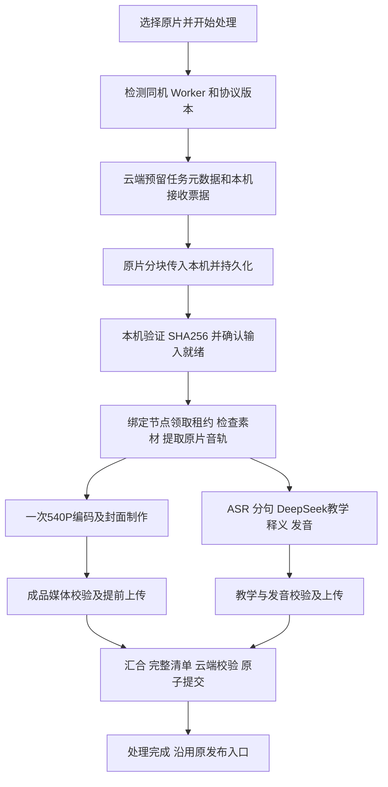

# M08 本地自动制作、云端只接收成品：实施与审计计划

日期：2026-09-17。代码证据基线：`665c795a1ab9b74256d2eb2476f187fab28f0225`，beta6.48.0。

状态：**待实施计划；本轮只编写文档并审查设计，不修改业务代码、不运行迁移、不部署。** 下列新增接口和文件都是拟实现项，不能当作已存在的 API。代码片段分为明确的数据契约和实施骨架；骨架中依赖的函数必须按本文件要求实现、测试后才能投产，不得复制后跳过校验直接上线。

## 1. 用户要求与完成定义

用户不再使用格式工厂预处理。正常操作为：选择一个或多个原视频，保留现有标题、创作者和可选封面设置，点击“开始处理”；系统自动完成本地接收、检查、540P、字幕、DeepSeek 教学分析、全词释义与发音、成品上传和云端校验。完成后维持现有审核／发布方式，本次不把自动处理扩大成自动公开发布。

- 原片只在本地制作期间使用，默认不上传 R2，也不先从 R2 下载。
- 成功接收进本机任务目录后才提示“可关闭网页”；未接收完整时关闭网页，需要重新选择同一文件继续接收。
- 处理期间电脑需开机、不休眠，本地 Worker 后台隐藏运行。发起任务、AI 和云端上传需要联网。
- 成品发布后学生完全从云端观看，电脑关机不影响观看。
- 不取消语义复核，不降低翻译／重点词质量，不删普通单词释义和发音，不重做旧视频。
- 局部失败有“刷新状态”“继续处理”；取消是独立动作。刷新不能重跑，也不提供任意跳过质量门禁。

首版范围属于 M08；只修改上传和处理编排，以及 M07 内容保存和 M04 媒体解析所依赖的必要公开契约。M01 会员、学生 UI、重点词颜色、目录排版不在本轮重构范围。

## 2. 已核对的现状与必须解决的衔接

| 代码位置 | 当前行为 | 新流程要求 |
| --- | --- | --- |
| `admin/assets/studio-v2.js` / `submitOne` | 云模式先 `Cloud.uploadVideo`，然后创建任务；本地模式是另一套任务 | 增加生产用 local-first 入口，不能用 `Store.localOnly=true` 冒充完成云端接入 |
| `shared/cloud-content.js` / `uploadVideo` | multipart 完成后才 `EastudyLocalSource.preserve` | 新入口只预留云端任务元数据，不上传原片；旧入口保留供旧任务兼容 |
| `admin/assets/local-source.js` | 8789 可选接收，依赖云端 ETag，60 秒总超时 | 新版本分块可续传接收协议，不再以云端原片 ETag 作为本地文件凭证 |
| `services/cloud-worker/local_source.py` | 原片是可清理缓存，依赖云端回执并复制到任务目录 | 新原片是受保护的任务输入，不得被旧 10 GiB／7 天缓存回收误删 |
| `services/cloud-worker/worker.py` | 普通任务固定读取 `source_key`、下载、串行制作、上传 | 显式区分本地输入和旧云端输入；领取绑定实际持有原片的节点 |
| `services/local-studio/pipeline.py` | 转码完成后才提取音频、ASR；进度是单一标量 | 先提取原片音频；媒体与教学分支受限并发，进度按阶段独立保存 |
| `supabase/functions/video-processing/index.ts` | 统一 Worker action、租约和回传 | 新增版本化本地输入登记与领取；旧 Worker 不能误领本地输入任务 |
| processing SQL、媒体／发音／删除 resolver | 多处从 `source_key` 推导成品命名空间 | 明确区分“保留的命名空间键”和“真实存在的原片对象”，不得随意置空破坏消费者 |
| `functions/api/processing/output.js` | 单资源上限 15 MiB，已有运行和删除写入保护 | 继续上传 HLS 小分片等白名单成品，不改成上传一个大 MP4 |

现有 `report_download` 即使复用本机副本仍写“正在下载原片”，文案必须随真实来源改变。单凭该文案和 400 MB 总数不能证明发生了实际下载。

## 3. 新流程与依赖图



“本地传入”是浏览器向 `127.0.0.1` 发送文件，不是互联网上传。普通网页拿不到任意原片磁盘路径，因此首版采用一次流式本机副本，避免依赖浏览器私有路径或要求用户反复授予目录权限。不使用整文件 `arrayBuffer()`，不把几百 MB 原片存入 localStorage／IndexedDB。

已接收的原片直接从受保护输入目录读取，不再复制一份到 Worker 工作目录。浏览器不负责执行 FFmpeg，不使用浏览器 WASM 压片。

## 4. 数据与命名空间：兼容策略

首版采用最小兼容变更：保留现有非空 `processing_jobs.source_key` 的格式，**对新任务它只是服务端预留的命名空间键，不表示 R2 已存在原片**。例如仍生成 `videos/<server-generated-uuid>/source.mp4`，但绝不创建虚假零字节对象，也不向学生或管理员提供这个原片下载链接。

新增私有 sidecar 表，明确真实输入类型、所属节点和接收状态。旧任务没有 sidecar 时由统一 resolver 归为旧 `cloud_r2`；禁止每个消费者自行猜测。有 sidecar 但数据无效必须报错，不能回退为云端原片。

SQL 结构草案（必须新增前向迁移，不得编辑已部署迁移）：

```sql
create table private.processing_local_inputs (
  job_id uuid primary key references public.processing_jobs(id) on delete cascade,
  protocol_version integer not null default 1 check (protocol_version = 1),
  worker_id text not null check (worker_id ~ '^[A-Za-z0-9._-]{3,80}$'),
  source_id uuid not null unique,
  intake_state text not null check (intake_state in ('RECEIVING','READY','MISSING','CANCELLED')),
  source_name text not null,
  source_size bigint not null check (source_size > 0 and source_size <= 2147483648),
  expected_sha256 text not null check (expected_sha256 ~ '^[a-f0-9]{64}$'),
  source_sha256 text check (source_sha256 ~ '^[a-f0-9]{64}$'),
  cover_sha256 text check (cover_sha256 ~ '^[a-f0-9]{64}$'),
  ready_at timestamptz,
  updated_at timestamptz not null default now(),
  check (intake_state <> 'READY' or (source_sha256 is not null and source_sha256 = expected_sha256 and ready_at is not null))
);
alter table private.processing_local_inputs enable row level security;
revoke all on private.processing_local_inputs from public, anon, authenticated;
```

2 GiB 沿用当前输入限制，不是允许内存读入 2 GiB。客户端预检查、服务端逐块限额和磁盘容量预留都要执行。跨表变更仍遵守已有 snapshot → job → 本地输入／运行记录的锁顺序；幂等 requestId 的事务锁沿用现有规则。不得持有数据库事务锁等待文件传输或 AI 响应。

拟新增协议，字段采用 camelCase；SQL 参数由 JS／Edge 单处映射为 p_snake_case：

```ts
type LocalInput = {
  kind: 'local_file'; protocolVersion: 1;
  sourceId: string; workerId: string;
  name: string; size: number; sha256: string;
};
type InputDescriptor = LocalInput | {
  kind: 'cloud_r2'; key: string; downloadUrl: string;
};
type StageProgress = {
  stageId: string;
  state: 'PENDING' | 'RUNNING' | 'DONE' | 'ERROR';
  attempt: number; sequence: number;
  current: number | null; total: number | null;
  unit: 'bytes' | 'media_seconds' | 'sentences' | 'items' | 'batches' | null;
  heartbeatAt: string; lastProgressAt: string;
};
```

同一 workerId 必须与已认证节点、能力报告和本机一次性 challenge 对应，不能只相信浏览器提交的 workerId 字符串。长期 Worker secret 和 AI key 永远不下发浏览器。

### 4.1 必须同时核对的消费者

| 消费者 | 实施要求 |
| --- | --- |
| 创建／领取／重试 | 本地输入 READY 后才能排队领取；绑定节点、协议版本；旧领取 RPC 一律排除 local 输入 |
| source 下载 resolver | 本地输入明确返回 `SOURCE_LOCAL_ONLY`；Worker 不调用云端 HEAD／GET |
| output 与播放、封面、发音 resolver | 保留现有命名空间推导和 run 路径，沿用鉴权与 receipt；证明没有对原片对象存在性的隐藏依赖 |
| 学习修复 | 无需原片的 `LEARNING_REPAIR` 保持可执行，不要求本机原片或绑定旧节点；沿用正确命名空间、当前字幕和视频身份 |
| 重新编码／重新 ASR | 需要原片时用输入 resolver；原片丢失提示重新选择并校验 SHA，不允许下载不存在的对象或偷偷从低清成品再压缩 |
| 内容保存和发布 | `mediaKey` 保留为内部命名空间兼容字段；原片是否可取只看来源描述，`mediaUrl` 只指成品 |
| 永久删除 | 原片对象清单仅包含真实 cloud_r2 原片；local 任务仍列出成品前缀、所有 run 和在途写入；不漏删成品，不改变确认删除权限 |
| 任务分组与错误窗口 | 仍每个视频一张卡；接收中／等待本机不能被显示为云端下载 |

保持 legacy source_key 的好处是避免一次性改写所有路径与播放票据；代价是字段名字存在历史歧义。必须用统一输入描述封装，不能让新代码继续以 `source_key != null` 推断原片在云端。后续独立迁移命名空间不属于本次任务。

## 5. 接口与一次点击流程

拟新增 `admin_reserve_local_processing_job_v1`：管理员身份检查 → 校验健康节点／能力／challenge → 服务端分配 namespace、jobId、sourceId → 幂等创建草稿和 WAITING 任务 → 返回短期 intake ticket。复用现有 requested_by + idempotency_key 唯一约束；同键不同文件声明或元数据必须报冲突。重复创建检查应先于过期 revision 拒绝，以便响应丢失后取回同一结果。

预约前在浏览器 Web Worker 中按块增量计算原片 SHA256，绑定预约的 `expectedSha256` 和票据；复用经过测试的增量 SHA256 实现，不把不支持流式输入的 `crypto.subtle.digest` 当作整片流式哈希。此过程只读本地文件，不转码、不上传互联网，无需用户额外操作。重新选择文件续传时重新计算全片 SHA，必须与预约相同；接收完成后本机独立计算 SHA 并再次比较。预计算增加一次本地顺序读取，换取完整同源验证；不能只检查已经收到的前半段。

预约会改变 M07 草稿 revision，因此复用现有 Bridge 的 `flush()`／`importMutation()` 公共契约：创建前等待未保存草稿写入，预约返回权威 snapshot 和 revision，导入后才允许下一条预约。全页使用共享内容写入队列协调自动保存与预约，不能只在上传函数内部加锁。冲突时重新加载并合并用户未保存编辑，保留 requestId 和 File；同任务响应重放返回当前权威快照，不能用旧快照覆盖新内容。不得跨板块直接修改 Store 私有状态。

接收期间云任务兼容使用 `WAITING`、`LOCAL_DOWNLOAD`，人类名称和真实步骤取 `work`／metrics 的 `local_receive`；只有本地确认后成为 `QUEUED`。不为展示改一大批旧状态枚举。云端原片下载与本地接收必须在接口字段上可区分。

本机接口 v2（拟新增，和旧可选缓存入口并存）：

| 方法和路径 | 请求／响应要点 |
| --- | --- |
| `GET /v2/capability` | 协议版本、本机节点身份、短期 challenge、服务状态；无长期密钥 |
| `POST /v2/intakes` | 云端签发的短期接收票据；返回 intakeId、sourceId、chunkBytes、已接收块摘要 |
| `PUT /v2/intakes/:id/chunks/:index` | 二进制块、块 SHA256；校验偏移、长度、摘要；同块同内容可重放，不同内容 409 |
| `GET /v2/intakes/:id` | 接收状态和块回执，仅返回本任务，不返回绝对磁盘路径 |
| `POST /v2/intakes/:id/complete` | 检查完整覆盖，流式计算整片 SHA256，探测格式，fsync 后原子就绪；可轮询长校验 |
| `POST /v2/intakes/:id/renew` | 同管理员经云端重签短票据；保留原 intakeId，不生成第二任务 |

封面通过同一 intake 的受限 cover 子资源接收，独立尺寸／格式／摘要校验；保留“未选封面则从原片抽帧”的行为。不得丢掉当前可选封面功能。

接收票据绑定管理员、jobId、sourceId、workerId、challenge、origin、文件声明、有效期和随机 nonce。本机通过已认证 Worker 通道核验／兑换票据，重复兑换限同 intake。监听仅 127.0.0.1；沿用来源／Host 检查并补齐 POST、PUT、OPTIONS 和实际请求头。真实 Chrome 验证本地网络访问权限；用户拒绝时明确显示原因，不无限轮询。

前端编排骨架：

```js
async function submitLocalFirst(row, metadata, deps) {
  // pending 保存在 IndexedDB：只放 ID、文件声明与进度，不放视频或票据。
  const pending = await deps.pending.getOrCreate(row.id, row.video, metadata);
  const capability = await deps.intake.requireReady({ protocolVersion: 1 });
  const sha256 = await deps.fileIdentity.hashInWorker(row.video);
  await deps.pending.assertOrBindIdentity(pending.requestId, sha256);
  const reservation = await deps.contentMutations.run(async () => {
    await deps.bridge.flush();
    const result = await deps.cloud.reserveLocalJob({
      requestId: pending.requestId, expectedRevision: deps.bridge.revision(),
      metadata, source: { name: row.video.name, size: row.video.size, expectedSha256: sha256 },
      workerId: capability.workerId, challenge: capability.challenge,
    });
    if (result.error) throw result.error;
    await deps.bridge.importMutation(result); // 权威 snapshot/revision，再处理下一条
    return result;
  });
  await deps.pending.bind(pending.requestId, reservation.jobId);
  const intake = await deps.intake.open(reservation.intakeTicket);
  await deps.intake.sendMissingChunks(intake, row.video, row.cover);
  await deps.intake.complete(intake); // 重试同一个 intake，不重新创建任务
  // 本机服务自己登记 READY 并重试登记，不能依赖此网页继续存活。
  return deps.cloud.getProcessingJob(reservation.jobId);
}
```

`sendMissingChunks` 默认 8 MiB 块、本机同时发送 1 块，队列最多 2 个接收任务；按块读写并校验。断线退避重试同一块，读取权威回执再判断完成，不猜客户端已发字节。长文件使用每块超时／无进展超时，取消旧 60 秒整片超时。整片 SHA 在本机流式计算，续传重新选择文件时必须校验已收块对应内容，不能只比较名称和大小。

上述 `contentMutations` 是拟实现的协调契约；调用其中的 `flush` 时不能再次排到同一个被占用队列等待自身。实现应由 Bridge 提供一个“完成待保存内容并执行预约”的原子编排入口，或在持有写入令牌时调用不重复入队的内部操作；增加嵌套同步不死锁测试。文件哈希、块接收不占内容写入锁；长哈希结束后需要重新确认或更新已过期 challenge。

## 6. 本机持久化与调度

新建 `local_intake_store.py`，使用标准库 SQLite 管理 intake／chunk 回执、源文件和任务绑定、outbox、阶段状态。事务与唯一约束保证多线程／进程一致性；不直接扩展目前 `JobStore.get()+write()` 为并发进度协调器。数据库配置 WAL、busy_timeout，单处写入或短事务更新，恢复时执行完整性检查。

目录仅由随机 ID 派生：`worker-root/local-inputs/<sourceId>/source.bin`。显示名称不参与路径拼接；拒绝链接穿越、目录越界和客户端指定绝对路径。接收块先写临时文件并 fsync，再持久化回执；文件与 DB 崩溃窗口通过启动扫描核对摘要恢复。完成时原子生成源回执，active／失败待续跑输入禁止缓存清理。

云端 READY 确认通过持久 outbox 发送：就绪文件和 outbox 在本地可靠保存后，即使网页关闭或登记响应丢失，本机仍重试同一 sourceId 和摘要；云端重复同摘要成功、不同摘要冲突。确认时校验任务仍有效、未取消、未入回收站；取消后的接收不得复活任务。

Worker 领取必须同时满足：输入 READY、workerId 相同、节点声明 localInputV1、任务当前有效。旧 `worker-claim`／所有旧 SQL 领取入口必须排除 local 任务，不只在新 Worker Python 中过滤。

```python
def resolve_input_source(lease, local_inputs, cloud_download):
    desc = lease['inputSource']  # 由服务器生成并严格校验
    if desc['kind'] == 'local_file':
        if desc['workerId'] != lease['workerId']:
            raise InputError('LOCAL_SOURCE_WRONG_WORKER')
        # 核验就绪回执、大小、SHA；返回受保护源文件，不再复制。
        return local_inputs.require_ready(
            source_id=desc['sourceId'], size=desc['size'], sha256=desc['sha256'])
    if desc['kind'] == 'cloud_r2':
        return cloud_download(desc['downloadUrl'], source_key=desc['key'])
    raise InputError('SOURCE_KIND_INVALID')
```

既有 EdgeClient 公共响应需要补 `inputSource`／workerId，保留旧 job 字段兼容。原任务 runId、token、leaseUntil 和取消 fence 继续有效；不另建绕过云端权限的“本地成功”发布入口。

## 7. 一次编码与受限并发

保持 `media_tools.ladder` 的 `balanced-540-v1`：H.264、yuv420p、短边不超过 540、长边不超过 960、不放大、等比且偶数尺寸；最高 30fps，保留当前有理数帧率策略；CRF25、maxrate 800k、bufsize 1600k、AAC96k、4 秒 HLS 分片。800k 是限制参数，不是恒定码率或精确体积承诺。原片只经过一次有损视频编码，禁止“先生成 MP4 再编码 HLS”。

原片音频提取为现有识别用 PCM16k mono，直接来自原片。编码参数、ASR 模型、DeepSeek 完整复核默认保持不变。硬件编码和新的 token 压缩实验不在本次默认启用范围，避免同时改变语义／画质基线。

实现有向依赖调度器，首版全机限制：1 个活动视频处理、1 个媒体编码、1 个 GPU 推理占用、2 个成品上传；每批 AI 沿用现有并发上限，并纳入全机资源预算。启动时检测 CPU／显存，资源不足自动串行；不能用多个视频同时满载 GPU 来制造“并行”。FFmpeg CPU 线程必须限额，先用不超过逻辑核数一半的可配置值做对照，不承诺固定提速比例。

调度骨架（`scheduler` 是拟新增受控组件，必须实现以下不变量）：

```python
def build_graph(ctx):
    return [
        Stage('probe', (), 'io', ctx.probe),
        Stage('extract_audio', ('probe',), 'cpu_media', ctx.extract_audio),
        Stage('media', ('extract_audio',), 'cpu_media', ctx.encode_and_cover),
        Stage('asr', ('extract_audio',), 'gpu', ctx.transcribe),
        Stage('teaching', ('asr',), 'ai', ctx.build_teaching),
        Stage('voice', ('teaching',), 'gpu', ctx.prepare_voice),
        Stage('upload_media', ('media',), 'network', ctx.upload_media),
        Stage('upload_voice', ('voice',), 'network', ctx.upload_voice),
        Stage('commit', ('upload_media', 'upload_voice'), 'io', ctx.validate_and_commit),
    ]
```

`ctx.build_teaching` 必须是以下现有能力的组合适配器，不能直接映射为现有同名 `complete_teaching` 补齐函数。保留每步缓存、进度、取消和 usage 统计：

```python
def build_teaching(ctx):
    rows = semantic_segments(ctx.transcript, ctx.job_id, ctx.duration,
        ctx.ai_config, ctx.progress, ctx.checkpoints / 'segmentation')
    meta = {**ctx.metadata, 'duration': ctx.duration,
        'wordsPerMinute': round(sum(len(r['english'].split()) for r in rows)
                                * 60 / ctx.duration)}
    learning, metadata, provenance = enrich(rows, meta, ctx.ai_config,
        ctx.progress, cache_dir=ctx.checkpoints / 'ai')
    learning, completion_provenance = complete_teaching(learning, ctx.ai_config,
        ctx.progress, ctx.checkpoints / 'teaching-completion')
    return {'sentences': learning, 'metadata': metadata,
            'provenance': [*provenance, *completion_provenance]}
```

下游 voice 消费该结果的 sentences，最终提交沿用现有 metadata 难度／标签和 evidence 映射，不得只保存句子而丢掉视频元数据。

- 调度器检查依赖无环；**先依赖就绪再申请资源**，不占 GPU 等待 AI 或网络。
- 正常分支失败：阻断其依赖，允许独立分支在有效租约下完成并保存检查点；最终任务报失败，不 commit。
- 取消、丢租约、入回收站：统一 stop event，停止新工作，终止自有 FFmpeg 子进程，禁止新上传／回写。已在途写入仍由现有 durable write fence 处理。
- 心跳独立于主调度和 AI 请求，资源繁忙不能阻塞续租。网络断开无法续租时，在租约安全期限内停调度；不声称离线后无限继续收费 AI 请求。
- 全部进度写入经单一 reducer；并行阶段不能互相覆盖 `currentStep`、把完成比例写回更小值或错误标记总任务成功。
- 固定锁顺序，不在持有资源许可时等待另一个未来阶段；上传队列必须有界。

## 8. 断点、运行隔离与成品回传

检查点键必须包含真实源 SHA、阶段输入摘要、模型／提示词／编码配置版本。修改标题不必重新编码，修改字幕会使对应教学与发音身份重新核验；仅更新时间或文件名不能作为有效缓存证据。

```python
checkpoint_key = canonical_hash({
    'stage': stage_id, 'sourceSha256': source_sha256,
    'inputs': dependency_hashes, 'profile': stage_profile_version,
})
# 复用必须同时验证产物存在、大小、SHA、格式和依赖版本。
# 写 stage 临时目录 -> 验证 -> 原子发布回执，禁止半成品命中。
```

本地执行目录按 `jobId/runId` 隔离，旧运行不能覆盖新运行文件。复用通过只读已验证产物和新运行回执；发音二进制可以复用，但包含 runId／条目身份的 manifest 必须重新绑定校验。不能只把旧 manifest 原样提交到新 run。

成品上传仍走 `functions/api/processing/output.js`、`begin_processing_output_write`、`worker-register-output-v2` 与 `worker-complete-v3 + worker-finalization-status-v3 + worker-defer-v3`。每个文件上传回执持久化键为 `(jobId, runId, relativePath, sha256, size)`；本地显示成功不足以跳过上传，必须查询或重新确认服务端登记。若新增输出状态查询，只允许当前租约查看服务端派生路径。

- 同 run 网络失败只补缺失上传；响应不确定时先对账，不重新跑 AI。
- 新 run 不直接借用旧 run 的上传登记；从本地复用成品并按新 run 路径重新上传登记，保持现有运行 fence。
- 媒体分支上传时只上传完整封闭的 HLS 集；清单与各分片路径、时长、大小、摘要都校验。禁止任意目录递归上传，禁止上传原片、audio.wav、日志、检查点、密钥和本地绝对路径。
- 每个资源保持 15 MiB 限额；超过上限给出媒体阶段可处理错误，不盲目无限重试 HTTP413。
- 同 run 注册清单去重后原子 commit，复用现有教学完整性、发音登记、当前视频指针和删除锁校验。commit 响应丢失可查询确认，不再建任务。
- 成品尚未完成时不得被发布。R2 提前存在资源不等于学生拥有访问权限。

## 9. 用户看见的状态和恢复按钮

| 情况 | 显示 | 行为 |
| --- | --- | --- |
| 本机服务未启动／不可达 | 本机处理服务未连接 | 重新检测；提供已安装的隐藏启动器入口说明；网页不能承诺无授权任意拉起 Windows 程序 |
| 原片传入本机 | 正在读取本地视频 X / Y MB | 接收完成前保留网页；这不是云端上传 |
| 接收完成、节点忙 | 已保存到本机，等待制作 | 浏览器可关闭；等待绑定节点 |
| 原片丢失／缓存损坏 | 请重新选择原视频 | 校验同一 SHA 后恢复；不回退互联网原片上传 |
| 转码／ASR／教学／发音 | 分步骤真实进度、最近进展时间 | 未知总量不显示虚假百分比 |
| 上传 | 正在上传成品 X / Y MB | 失败只补传，不重新制作 |
| 心跳在线但长期无推进 | 此步骤较长时间没有进展 | 提供刷新、诊断和取消；不能仅凭心跳判定健康，也不能只凭计时断言卡死 |
| 可恢复错误 | 已保留完成部分，继续处理 | 使用既有幂等控制命令，服务端决定恢复边界 |
| 电脑休眠／断网 | 等待本机恢复／连接恢复 | 确认旧租约失效并安全取得新 run 后继续，不允许两个 run 并行回写 |
| 手机／另一台未装服务设备 | 此设备未连接制作服务 | 说明需要在制作电脑选片；旧云端上传仅保留兼容入口，用户明确选择才启用，不静默上传大原片 |

原片本机存储策略：活动任务和失败待恢复任务不自动删除；成功任务首版同样不自动清理原片，仅展示磁盘占用并提供明确的本地清理操作。清理只删除应用副本，不删除用户选片路径；空间不足在接收前拦截并解释所需空间。200 视频逐项接收、逐项容量检查，不承诺无限囤积。

## 10. 分阶段执行清单

| 阶段 | 主要文件／交付 | 完成门槛 |
| --- | --- | --- |
| P0 契约固化 | 新前向 SQL、`supabase/functions/video-processing/index.ts`、输入 descriptor resolver | 本地预约／确认／领取／取消／重复请求 SQL 回滚测试通过；所有旧领取入口排除本地任务 |
| P1 本机接收 | 新 `local_intake_store.py`、`local_intake_v2.py`；保留旧 `local_source.py` | 大文件分块、断线、刷新、整片摘要、磁盘不足、进程重启均可恢复 |
| P2 控制端接入 | 新 `admin/assets/local-processing-client.js`；调整 studio-v2、cloud-content、脚本加载顺序 | 一次点击创建一张卡，无原片 R2 请求；封面／标题／创作者不丢；按钮正确映射 |
| P3 制作编排 | 新 `services/local-studio/stage_scheduler.py`；改 pipeline、Worker 适配器、metrics | 一次编码、独立心跳、受限并发、原片音轨 ASR、有效检查点复用 |
| P4 上传与边界 | Worker upload／register；必要输入／删除／修复公开契约 | 旧／新来源的播放、发音、教学修复、重试和回收站均通过，不改学生 UI |
| P5 审计与验证 | 新专项测试、真实样片、code-review 双轴报告 | 以下全部关键验收通过，再进入发布 |
| P6 发布 | 新迁移 → Edge 兼容协议 → 新 Worker → 网页入口 | feature flag 默认关闭，组件协议兼容后仅启用新任务；记录版本和发布证据 |

修改前逐项登记允许文件；组合层仅编排，不把新领域逻辑继续堆进 admin.js。保持现有 beta6.48.0 发音缓存／GPU 功能、完整 DeepSeek 复核默认，不把此前未通过质量测试的 delta/table 实验偷偷开启。

## 11. 必须执行的测试与质量门禁

以下是计划测试，**不是本轮已经通过的结果**。

1. 真实大文件：选约 400 MB 原片，浏览器至云端没有原片 multipart 请求、R2 没有 source 对象；Worker 没有原片云端 HEAD／GET。区分 loopback 字节和互联网字节，不能仅凭文案验收。
2. 新／旧兼容：旧 cloud_r2 任务继续可下载；本地新任务只能由绑定且支持协议的节点领取；旧 Worker、另一节点和已取消任务均不能取得本地任务。
3. 幂等：双击开始、断线丢创建响应、丢 READY 响应、重复完整块、同编号异内容、租约重试，均不会多建视频／任务或混淆输入。
4. 接收恢复：关闭网页后重新选择同文件续传；同名同大小不同内容拒绝；进程被终止时部分块不算完成；票据过期可以重签续用。
5. 一次编码：记录 FFmpeg 视频编码调用数；已验证成品续跑为 0 次，新片为 1 次；音轨提取不计为视频编码。坏 HLS／源 SHA 改变应失效而非错误复用。
6. 质量：同原片固定配置和模型，对照现有540P成品，检查横／竖／旋转／低分辨率／24、25、29.97、60fps、音画同步及字幕首尾时间；未改变输出参数不得出现二次压缩。
7. 教学：原句数／tokenId／expressionId 映射、全部核心释义、俚语／四级以上重点词、自然中文、多音词 IPA 和发音均保持完整。AI 非确定性用同缓存或受控对照检查，不要求字面输出一模一样。
8. 并发：模拟媒体慢、ASR 慢、AI 超时、单分支失败、上传阻塞、取消和丢租约；没有资源互等死锁，心跳继续，旧 run 不写新 run。
9. 上传：断网、503、响应丢失、413、摘要错、登记丢响应、新 run 补传、commit 丢响应；结果缺一资源不得完整提交。
10. 映射：新视频学生端可播放、封面加载、词卡发音、教学修复；非 VIP 门禁不受影响；控制端回收站屏蔽、恢复和永久删除完整派生清单都正确。生产验收禁止实际物理删除 R2；删除行为用隔离夹具验证。
11. 浏览器：真实制作电脑 Chrome 测 loopback 权限、刷新／关闭和后台继续；连接器不可用不能把 HTTPS 检查写成浏览器交互通过。
12. 容量／服务：接收前检查原片副本＋预计成品＋PCM＋临时文件＋余量；不足停止接收，保留可恢复任务；计划任务隐藏启动，更新仅在无活动工作安全边界执行。
13. 草稿衔接：两个视频连续预约、有未保存编辑、自动保存同时触发、预约响应丢失、revision 冲突，均保留用户编辑和同一个 requestId；新版快照不被旧响应覆盖，Bridge 写入队列不自锁。
14. 完整同源：重选文件只改变尚未上传的后半段时仍拒绝；本机最终 SHA 不符不可 READY。教学组合适配器验证分句、enrich 和补齐复核三步均有执行或有效缓存证据，元数据／usage／词卡映射不丢失。

契约测试代码示例（拟新增 Python 测试，依赖实现后的注入接口）：

```python
def test_local_source_never_uses_cloud_download(local_inputs, local_lease):
    def forbidden(*args, **kwargs):
        raise AssertionError('local input must not perform cloud source HEAD/GET')
    path = resolve_input_source(local_lease, local_inputs, forbidden)
    assert path == local_inputs.expected_path

def test_retry_reuses_media_but_rebinds_voice_run(harness):
    first = harness.run_until_upload_failure()
    second = harness.retry(first.job_id)
    assert second.video_encode_calls == 0
    assert second.voice_manifest.run_id == second.run_id
    assert second.run_id != first.run_id
    assert second.all_word_card_mappings_valid
```

发布前运行仓库已有相应检查：`npm run test:m08`、`npm run cloud-test`、`npm run studio-test`、`npm run learning-test`、`npm run deletion-test`、`npm run test:m04`、`npm run test:module-boundaries`，并按共享契约影响执行 `test:mapping` 和发布全量门禁。命令具体依赖按当前 package.json 核验，不伪造通过记录。

性能记录同一原片旧链路／新链路的本地接收、原片互联网字节、转码、ASR、AI、发音、成品上传、总墙钟、CPU／显存峰值和失败率。目标是原片互联网传输为零且质量不退步，不预先承诺总时长减半或 AI 账单固定下降。

## 12. code-review 方法、发布与回退

本次用户请求是设计文档，业务代码相对基线没有本轮差异，因此不假造 `git diff <base>...HEAD` 非空审计。本次将 code-review 的 Standards／Spec 双轴用于**文档中的设计与代码骨架**；实际实现后必须再对真实代码差异执行完整技能流程。

计划审查来源：当前用户要求、第1节范围、`AGENTS.md`、`docs/FUNCTIONAL_MODULES.md` 和现有接口证据。仓库缺少 `docs/agents/issue-tracker.md`；技能建议使用 `/setup-matt-pocock-skills` 补齐 issue 工作流。本轮无 issue 引用，直接以本文件和用户要求作为规格，不为写计划安装或改造仓库工具。

实施审查基线默认采用实际开始修改前解析得到的 main 完整 SHA，记录与本文件基线的差异；若仍为665c795则沿用，不能因为时间过去就假定不变。实际审查命令记录为 `git diff <implementation-base>...HEAD`、`git log <implementation-base>..HEAD --oneline`；未提交内容另列工作树 diff，不把空差异称为通过。

发布遵守仓库顺序：验证新增迁移 → 兼容 Edge 协议部署 → 安全边界更新隐藏 Worker 并核验协议／心跳 → 按规则 fast-forward main、push GitHub、等待 Cloudflare → Chrome／授权 HTTPS 验收。Edge 和网页分别记录部署证据；新入口在所有依赖就绪前保持关闭。发布步骤不得物理删除 R2 原片或改旧视频。

回退关闭新入口，旧云端任务仍走旧代码；已经接收的本地任务保留新 Worker／协议完成或受控取消，**不能把它们交给旧 Worker**。保留前向表结构和任务数据，故障恢复不执行删表／清盘。按 source kind 路由，不在回退时悄悄上传用户原片。

### Standards

独立审查发现 1 项 P1 设计缺口：预约新草稿后未显式同步 M07 权威快照和 revision，批量下一条可能冲突或被后续自动保存覆盖。依据 FUNCTIONAL_MODULES 的公开契约规则，已在第5节补充 Bridge 保存／导入、预约串行、冲突恢复和避免同步队列自锁，在第11节增加专项验收。独立复核确认该项在设计层关闭，未发现本次修订直接引入的新阻断项。剩余 Standards 阻断项：0；实际实现仍需验证。

### Spec

独立审查发现 2 项 P2 设计缺口：原先仅核对已收块不足以证明重选文件全片相同；教学阶段骨架可能被误接为仅执行补齐函数。已增加预约前完整 SHA、票据与数据库绑定、本机独立复核，以及分句 → enrich → complete_teaching 的完整适配代码和元数据映射。第11节新增对应反例验收，独立复核确认两项均在设计层关闭。剩余 Spec 问题：0；需求覆盖不代表运行环境没有 Bug。

双轴计数：Standards 初审 1 项、最高 P1，修订后剩余 0；Spec 初审 2 项、最高 P2，修订后剩余 0。本轮只完成文档与设计审查；Markdown 围栏配对、差异空白检查及引用的 npm 脚本名称已核对，未运行业务测试、数据库迁移或部署。

## 13. 交给执行 AI 的指令

先读取本文件、当前 AGENTS.md、FUNCTIONAL_MODULES.md 和上一轮 M08 效率文档，确认实际 HEAD 与在途任务；只实施 P0—P6 及其必要公开契约，不改其他业务板块。正常使用必须“选片 → 开始处理 → 自动完成制作与上传”，默认无云端原片；保留原始音轨来源、一次540P编码、完整教学与发音能力。所有新协议实现两端映射，所有旧领取入口隔离 local 任务，所有恢复遵守 run 和删除 fence。每阶段完成后运行最邻近行为测试；发布前完成真实样片、双轴 code-review、契约门禁和生产验收，报告已做／未做和证据，不把计划代码、缓存命中或模拟测试当作完整上线结果。
